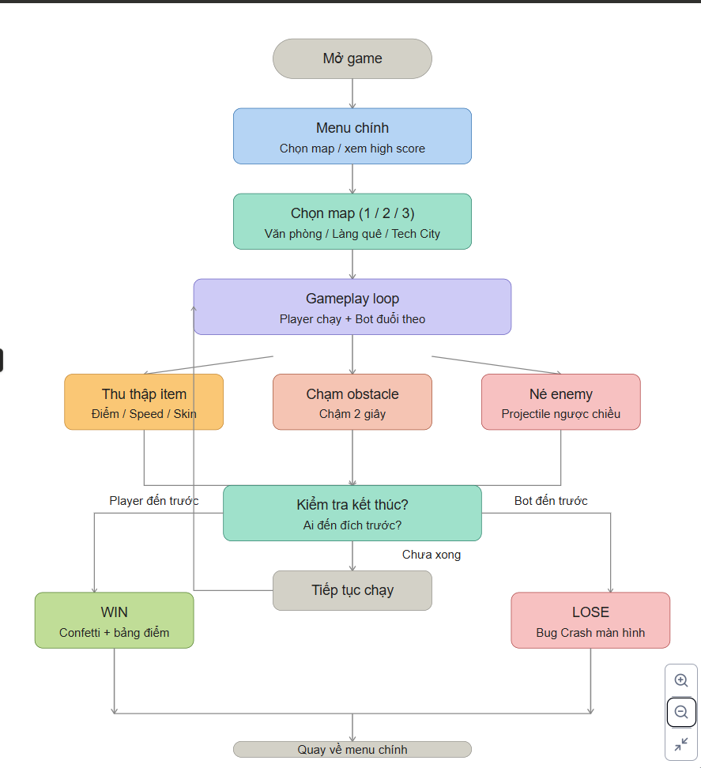

# MECHANICS

# Flowchart

---

# Player Movement

Tự chạy forward theo path (transform.forward * speed)

Swipe trái/phải → đổi lane (3 lanes)

Smooth lerp khi đổi lane (không teleport)

Camera follow bằng Cinemachine

Player chạm đích → WIN

---

# BOT AI

Di chuyển theo cùng path với player

Chuyển lane random theo time

Khoảng cách thắng/thua tính theo trục Z

Speed Bot tăng dần (challenge escalation)

Nếu Bot chạm vào bạn hoặc về đích trước → LOSE

---

# ITEMS

<aside>

Code Commit: +10 điểm, partical vàng 

</aside>

<aside>

Coffee: Chạm → speed*1.5/1.5 s 

</aside>

<aside>

Skin Up: Upgrade skin, speed x1.5/endgame

</aside>

---

# OBSTACLES & ENEMIES

<aside>

Bug Code: Chạm → Speed*0.5/2s

</aside>

<aside>

Meeting/Đá/Drone: Block lane

</aside>

<aside>

Email Bug: Spawn random (trên path thẳng), bắn projectile ngược chiều, trúng 1 lần - 15 commit

</aside>

---

# FLOW STATE

Thu thập 5 Code Commit liên tiếp → kích hoạt

Hiệu ứng: tăng tốc (speed*2) + particle ánh sáng xanh dương + nhạc nền đổi beat

Kéo dài 5 giây hoặc đến khi chạm obstacle/enemy 

---

# WIN/LOSE CONDITION

<aside>
🏅

WIN: Player chạm trigger box cuối path trước Bot → animation "Victory Pose" + confetti + bảng điểm "Promotion”

</aside>

<aside>
🏳️

LOSE: Bot về trước hoặc chạm player(Sẽ hiện thông báo bot nằm ở lane nào trước khi đi qua hoặc chạm vào player) → màn hình "Bug Crash" 

</aside>